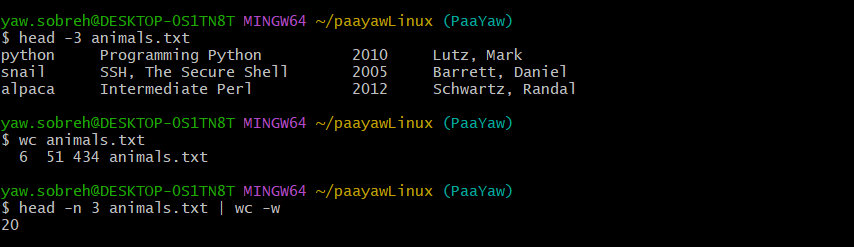
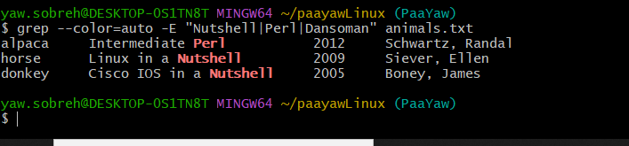
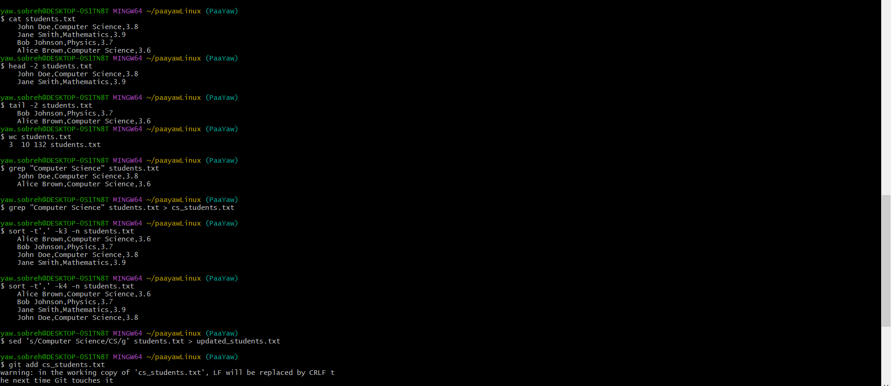
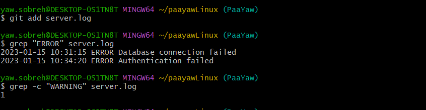
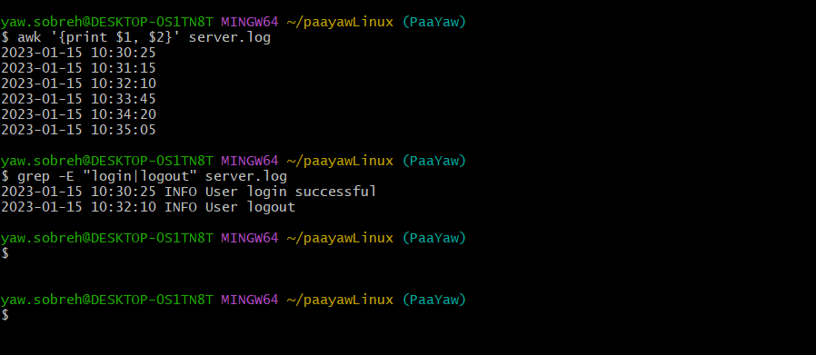

# Linux 101 👷🏻


## Exercise 1: Basic File Operations

### Questions
- [ ] **What is the difference between `cat` and `touch` commands?**
- [ ] **Create a file using the `cat` and the `touch` commands.**

### Answer
- `cat` is mainly used for reading, writing, and combining files. You can also create a file while simultaneously adding content.
- `touch` is used to create empty files or update the last modified timestamp of an existing file. It does not open the file for editing.

---

## Exercise 2: File Permissions

### Questions
- [ ] **What are file permissions in Linux, and what are the various ways of displaying them?**

### Answer
File permissions are assigned to three categories:
- **User (Owner)**
- **Group**
- **Others (Everyone else)**

### Additional Questions
- [ ] **What are the default permissions given to a file when it is created?**

### Answer
- Owner: Read and Write
- Everyone else: Read only

### More Questions
- [ ] **What are the default permissions given to a folder when it is created?**

### Answer
- Owner: Full permissions (Read, Write, Execute)
- Everyone else: Read and Execute

- [ ] **How do you create a folder in Linux?**

### Answer
- `mkdir foldername`

---

## Exercise 3: File Analysis

### Questions
- [ ] **Research and find the command used to print the number of lines, words, and characters in a file.**
  
### Answer
- `wc filename`

- [ ] **Apply the command to the `animals.txt` file attached to this exercise.**

### **Answer**
- 

---

## Exercise 4: File Content Analysis

### Questions
- [ ] **Using a Linux command, get the first 3 lines in the `animals.txt` file.**
- [ ] **Count only the words within this range. 🫣**

---

## Exercise 5: Text Search

### Questions
- [ ] **There is a command in Linux that starts with `g`, which has the capability to search through files. What is the command?**

### Answer
- `grep`

### Additional Task
- [ ] **Using this command, search for the words `Nutshell`, `Perl`, and `Dansoman` in `animals.txt`.**


## Exercise 6: Directory Operations

### Questions
- [ ] **What command is used to list all files in a directory?**

### Answer
- `ls`

### Additional Question
- [ ] **Wait a minute...what is a `directory` in Linux? 😅**

### Answer
- A directory is a storage location, similar to a folder.

---

## Exercise 7: Working Directory Commands

### Questions
- [ ] **What is the `pwd` command and what does it do?**

### Answer
- It prints the working directory.

### Additional Question
- [ ] **What is the difference between `echo` and `cd` commands?**

### Answer
- `cd` changes the working directory.
- `echo` is used to print text to the terminal.

---

## Exercise 8: Directory Stack and Move Operations

### Questions
- [ ] **What is the `dirs` command in Linux, and what does it do?**

### Answer
- The `dirs` command displays the list of directories in the shell's directory stack.

### Additional Question
- [ ] **I need to find out what the command `mv` does. What command do I need to use to find out more about `mv` in Linux?**

### Answer
- `mv` is used to move or rename files and directories.
- `man mv` → Opens the manual page for `mv`, providing detailed documentation.
- `info mv` → Displays more in-depth information about `mv`.
- `mv --help` → Shows a brief summary of how the command works and its available options.

---

## Exercise 9: Date and Text Processing

### Questions
- [ ] **Using the `date` command, print out the current day in the terminal.**

### Answer
```sh
$ date
Wed Jun 4 12:28:18 GST 2025
```

### Additional Question
- [ ] **What is the difference between `awk` and `grep` commands? Please provide examples.**

### Answer
- `grep` is used primarily for searching text patterns in files.
- `awk` is a full-fledged text-processing tool that allows filtering, formatting, and mathematical operations on structured text.

---

## Exercise 10: Environment Variables

### Questions
- [ ] **What are environment variables? List five environment variables (There is a command to list them out in your terminal. 😜).**

### Answer
- To list them, use: `printenv` or `env`
- Environment variables store system-wide settings, configurations, and user preferences.
- Examples: `PATH`, `HOME`, `USER`, `SHELL`, `PWD`.

### Additional Question
- [ ] **What is the difference between `more` and `less` commands?**

### Answer
- `more` allows only forward navigation.
- `less` allows both forward and backward navigation.

---

## Exercise 11: File Type Identification

### Question
- [ ] **There is a command in Linux for seeing the type of a file in a directory. What is that command?**

### Answer
- `file`

---

## Exercise 12: Unix Filesystem

### Question
- [ ] **The Unix system has a filesystem tree. What is it called, and list three important folders in this tree.**

### Answer
- It is called the **root directory tree**.
- Important folders: `/home`, `/etc`, `/var`.

---

## Exercise 13: File Content Viewing

### Question
- [ ] **In Unix, there are two commands: `head` and `tail`. Kindly illustrate how they are used in the Git Bash terminal.**

### Answer
- `head` shows the first 10 lines of a file.
- `tail` shows the last 10 lines of a file.

---

## Exercise 14: Student Data Management

### Task
- [ ] **Create a file called `students.txt` with the following content:**
```sh
John Doe,Computer Science,3.8
Jane Smith,Mathematics,3.9
Bob Johnson,Physics,3.7
Alice Brown,Computer Science,3.6
```

### Additional Tasks
- [ ] Display the entire contents of the file.
- [ ] Display only the first 2 lines.
- [ ] Display only the last 2 lines.
- [ ] Count the number of lines, words, and characters in the file.
- [ ] Search for all lines containing "Computer Science".
- [ ] Create a new file with only the Computer Science students.
- [ ] Sort the file by GPA (last column).
- [ ] Replace all occurrences of "Computer Science" with "CS" and check the final output.



## Exercise 15: Log Analysis

### Task
- [ ] **Create a log file called `server.log` with this content:**
```sh
2023-01-15 10:30:25 INFO User login successful
2023-01-15 10:31:15 ERROR Database connection failed
2023-01-15 10:32:10 INFO User logout
2023-01-15 10:33:45 WARNING Low disk space
2023-01-15 10:34:20 ERROR Authentication failed
2023-01-15 10:35:05 INFO System backup completed
```

### Additional Tasks
- [ ] Find all ERROR entries.
- [ ] Count how many WARNING entries exist.
- [ ] Extract all timestamps (first two columns).
- [ ] Find lines that contain either "login" or "logout".


